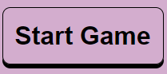

# Rock Paper Scissors 2

---

An interactive web game for playing Rock, Paper, Scissors, with a twist.
In this gamem, the user selects the move they want to make (traditionally either Rock, Paper, or Scissors), and the computer will pick a random move in response. The normal rock paper scissors rules apply, and a round winner is selected.

BUT this game has an extra option: You can play with 5 weapons, instead of the usual 3. Spock and Lizard are added to the game, and allow for many more possibilities in game play and outcomes.
In theory, you could add any number of extra weapons, as long as the total count remains an odd number. There is definitely opportunity here to allow the user to define their own extra weapons, and expand the game complexity almost indefinitely.

You can visit the site [here](https://robinf98.github.io/rock-paper-scissors-2/)
## Features

---

* ### Header

  * This header is added as a side bar, and is home to the Home, About, and Help buttons - The Help button only appears on smaller screens
  These links will take you to the home page (index.html), about page (about.html), and display the game description.

  * The game description is visible by default on wider screens. It explains the game, and the mechanics of which weapon will beat which other weapon.
  
  [Header](documentation/header.png)

* ### Game Area

  * This is where the game is displayed. It is topped by the Start / Reset button, which, once clicked, will start the game.
  
    

  * The game settings are listed here, for tweaking by the user

    

  * The game icons (the weapons rock, paper, scissors, lizard, Spock) will be displayed under the Start / Reset button

    [Game Icons (3)](documentation/game_icons_3.png)

    [Game Icons (5)](documentation/game_icons_5.png)

  * After each round, the game icons are replaced by a screen informing the user who won the round, or if it was a draw:

    [Round Win](documentation/round_win.png)
  
    [Round Lose](documentation/round_lose.png)

    [Round Draw](documentation/round_draw.png)

  * When a user clicks something that will leave the current game, a warning will pop up. A similar screen pops up when the game ends due to either the player or the computer winning the game

    [Leave Alert](documentation/query_leave.png)

    [Win Screen](documentation/win_screen.png)

    [Lose Screen](documentation/lose_screen.png)

## Testing

---

The site has undergone testing on 3 different browsers:
Chrome, Firefox, and MS Edge
All features work as they should, and the site makes no use of features that are not supported by all main browsers.
The site is also functional on mobile screens

### Validation

The site was tested on the following validators

* W3C HTML validator:
  * No issues were found through this validator
* W3C CSS (Jigsaw) validator:
  * The only issues the validator had was with the root variables, which are not buggy and are valid CSS
* JSHint:
  * This Validator reported the following:

    * There are 29 functions in this file.

    * Function with the largest signature take 2 arguments, while the median is 0.

    * Largest function has 12 statements in it, while the median is 3.

    * The most complex function has a cyclomatic complexity value of 4 while the median is 1.

  * There are no other validation errors in the JS

### Performance

 The following was generated from the Chrome DevTools lighthouse report:

* [Index](documentation/lighthouse_index.png)

* [About](documentation/lighthouse_about.png)

## Bugs

---

* Fixed Bugs
  * Set difficulty selector reverts to previous value when game resets due to changing difficulty
    * Fix: Removed code to set difficulty selector to old value
  * Help button displays on large screens
    * Fix: Edit help id in CSS to set default display to none
  * Help button does not function on small screens on about page
    * Fix: Remove help button from about page
  * Number of rounds input allows negative numbers and numbers greater than 50
    * Fix: Change input to slider
  * Score div alternating between visible and hidden
    * Fix: Set score div to hide on game reset, and show when game has started

* Unfixed bugs
  * About button will sometimes be unresponsive or lead to query that cannot be closed withour page reload
    * Was unable to recreate this bug in testing

## Additional

---

### Why use JSON

The data.JSON file was used to provide support for any future additions to the site. More content and weapons can be added without making any large changes to the JavaScript.
Even if no future updates occur, storing the data in a JSON file greatly reducs the complexity and length of the JS file, by eliminating the need for a long chain of if-else or switch statements.

## Credits

 ---

SVG's were sourced from [The Noun Project](https://thenounproject.com/), from the collection by [Juicy Fish](https://thenounproject.com/admin885/)

Much advice, testing, and encouragement was sourced from my CI mentor, [Juliia Konovalova](https://github.com/IuliiaKonovalova)