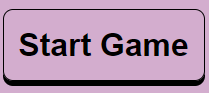
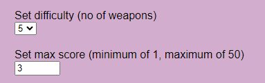

# Rock Paper Scissors 2

---

An interactive web game for playing Rock, Paper, Scissors, with a twist.
In this gamem, the user selects the move they want to make (traditionally either Rock, Paper, or Scissors), and the computer will pick a random move in response. The normal rock paper scissors rules apply, and a round winner is selected.

BUT this game has an extra option: You can play with 5 weapons, instead of the usual 3. Spock and Lizard are added to the game, and allow for many more possibilities in game play and outcomes.
In theory, you could add any number of extra weapons, as long as the total count remains an odd number. There is definitely opportunity here to allow the user to define their own extra weapons, and expand the game complexity almost indefinitely.

## Features

---

* ### Header

  * This header is added as a side bar, and is home to the Home, About, and Help buttons - The Help button only appears on smaller screens
  These links will take you to the home page (index.html), about page (about.html), and display the game description.

  * The game description is visible by default on wider screens. It explains the game, and the mechanics of which weapon will beat which other weapon.
  
  [Header](assets/documentation/header.png)
* ### Game Area

  * This is where the game is displayed. It is topped by the Start / Reset button, which, once clicked, will start the game. 
  
    

  * The game settings are listed here, for tweaking by the user

    

  * The game icons (the weapons rock, paper, scissors, lizard, Spock) will be displayed under the Start / Reset button

    [Game Icons (3)](assets/documentation/game_icons_3.png)

    [Game Icons (5)](assets/documentation/game_icons_5.png)

  * After each round, the game icons are replaced by a screen informing the user who won the round, or if it was a draw:

    [Round Win](assets/documentation/round_win.png)
  
    [Round Lose](assets/documentation/round_lose.png)

    [Round Draw](assets/documentation/round_draw.png)

  * When a user clicks something that will leave the current game, a warning will pop up. A similar screen pops up when the game ends due to either the player or the computer winning the game

    [Leave Alert](assets/documentation/query_leave.png)

    [Win Screen](assets/documentation/win_screen.png)

    [Lose Screen](assets/documentation/lose_screen.png)

## Testing

---

## Bugs

---

* Set difficulty selector reverts to previous value when game resets due to changing difficulty
  * Fix: Removed code to set difficulty selector to old value
* Help button displays on large screens
  * Fix: Edit help id in CSS to set default display to none
* Help button does not function on small screens on about page

## Credits

 ---

SVG's were sourced from [The Noun Project](https://thenounproject.com/), from the collection by [Juicy Fish](https://thenounproject.com/admin885/)
